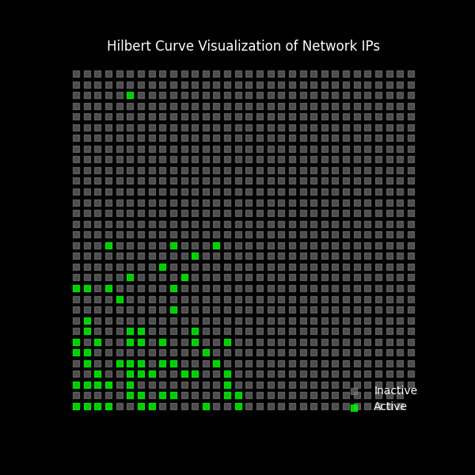

# PersonalNetworkPing
This Python program dynamically detects the user's network and subnet mask, then scans all available IP addresses by sending ping requests to determine which devices are active. The results are visualized using a Hilbert curve, which plots active and inactive IPs in a structured 2D representation. 

Example of my networks active IPs

Steps to run: 
1. Clone repository
2. Ensure necessary packages are installed
3. run program. After about a minute or so (depending on network size), hilbert plot will display with active IP's in green

Notes: 
- This program could likely be sped up greatly by adjusting the ping logic

Special Credit:
This project was inspired by suckerpinch's YouTube video "Harder Drive: Hard drives we didn't want or need" Link: https://www.youtube.com/watch?v=JcJSW7Rprio

